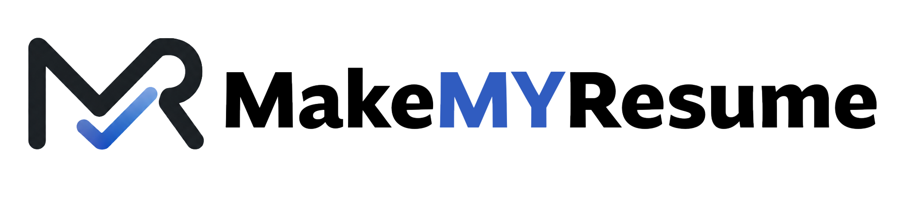
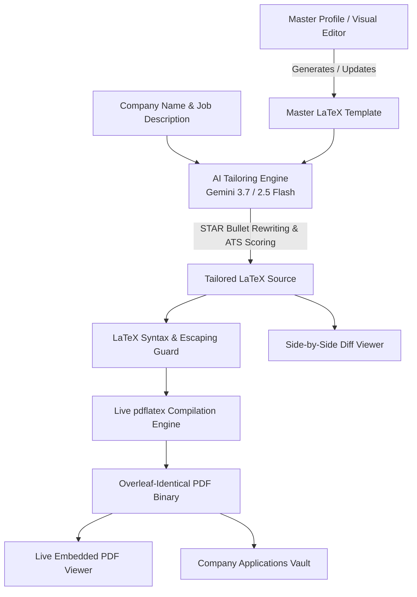

<div align="center">

  

  <p align="center">
    <strong>An Apple-inspired, AI-powered LaTeX resume compiler designed for campus placements and technical engineering drives.</strong>
  </p>

  <p align="center">
    
    
    
    
    
  </p>

</div>

---

## 📖 Overview

**MakeMyResume** solves the tedious manual effort of rewriting and refactoring your LaTeX resume for every campus placement drive, internship, and full-time engineering application.

Instead of manually editing `.tex` source code for each company:
1. You maintain your **Master Resume** (via the built-in **Visual GUI Editor** or raw LaTeX).
2. When a company arrives on campus or posts a role, you paste their **Job Description (JD)** and **Role**.
3. The **AI Tailoring Engine (powered by Gemini 3.7 / 2.5 Flash)** analyzes the JD, extracts key technologies, re-weights your bullet points using the **Google XYZ / STAR formula**, re-prioritizes your technical skills, and recalculates an **ATS Compatibility Score**.
4. The **Native LaTeX Compiler** compiles the code directly to an authentic, Overleaf-identical **PDF** ready for instant download and submission.

---

## ✨ Key Features

### 1. 🍎 Apple-Style Minimalist Design
- **Bento Grid Layout**: Clean, rounded surfaces (`rounded-[28px]`) with hairline borders and ambient glassmorphism shadows.
- **Dynamic Dark & Light Modes**: Seamless toggle with eye-friendly contrast in both pristine Apple Light (`#fbfbfd`) and OLED Dark (`#000000`).
- **Floating Island Navigation**: Frosted glass navigation with smooth pill Segmented Controls.

### 2. ⚡ AI-Powered Role-Specific Tailoring
- **Google Gemini 3.7 / 2.5 Integration**: Uses latest-generation Gemini models with intelligent multi-model fallbacks.
- **Role-Conditioned Rewriting**:
  - **AI / ML Roles** ➔ Highlights Agentic AI workflows (LangGraph, FastAPI), adversarial LLM validation, and multi-agent pipelines.
  - **Backend / Go Roles** ➔ Highlights Go, native B-Tree database architecture (bbolt), Redis caching, and microservices.
  - **Full-Stack / Frontend Roles** ➔ Highlights Next.js, TypeScript, state management, and high-performance UI systems.
- **STAR / XYZ Formula**: Reframes bullet points into: *"Accomplished [X] as measured by [Y] by doing [Z]"*.
- **LaTeX Safety Guard**: Escapes special characters (`\%`, `\&`, `\_`, `\$`, `\#`) while preserving all LaTeX command delimiters and environments intact.

### 3. 📄 100% Genuine Overleaf-Grade PDF Compilation
- **Live `pdflatex` Backend**: Compiles raw LaTeX with all packages (`fontawesome5`, `titlesec`, `tabularx`, `multicol`, `glyphtounicode`).
- **Pixel-for-Pixel Fidelity**: Renders Computer Modern serif typography, small-caps headers (`\scshape`), `\titlerule` dividing lines, right-aligned dates/locations (`\extracolsep{\fill}`), and FontAwesome icons (`\faPhone`, `\faEnvelope`, `\faLinkedin`, `\faGithub`, `\faGlobe`).
- **Live Embedded PDF Previewer**: Native browser PDF preview with zoom, fullscreen view in a new tab, and 1-click PDF / `.tex` downloads.

### 4. 🛠️ Direct Visual Details & Projects GUI Editor
- Edit your personal information, headline, contact URLs, summary, and skills without writing LaTeX code.
- **Interactive Projects Manager**: Click **`+ Add Project`** to insert new projects with title, tech stack, dates, and bullet points.
- **1-Click Sync**: Click **`Save & Sync to LaTeX`** to automatically regenerate your exact, valid LaTeX template.

### 5. 🗄️ Placement Applications Vault
- Automatically archives every company-specific resume generated.
- Search and filter by company name, role, or tech stack.
- Track application stages (*Applied*, *Interview*, *Offer 🎉*, *Draft*, *Rejected*).
- Export vault records to JSON for backup or restore on any machine.

---

## 🏗️ System Architecture



---

## 🛠️ Technology Stack

- **Framework**: [Next.js 14](https://nextjs.org/) (App Router, Server Components & Route Handlers)
- **Language**: [TypeScript 5.7](https://www.typescriptlang.org/)
- **Styling**: [Tailwind CSS 3.4](https://tailwindcss.com/) + Custom Apple Design Tokens
- **AI SDK**: [@google/generative-ai](https://www.npmjs.com/package/@google/generative-ai) (Gemini 3.7 / 2.5 / 2.0 / 1.5)
- **LaTeX Engine**: `pdflatex` compilation pipeline with web service fallback
- **Icons**: [Lucide React](https://lucide.dev/)
- **Diff Calculation**: [diff](https://www.npmjs.com/package/diff)

---

## 🚀 Getting Started

### Prerequisites

- [Node.js](https://nodejs.org/) v18.17.0 or higher
- npm, yarn, or pnpm

### Installation

1. **Clone the repository**:
   ```bash
   git clone https://github.com/ManishRShetty/MakeMyResume.git
   cd MakeMyResume
   ```

2. **Install dependencies**:
   ```bash
   npm install
   ```

3. **Configure Environment Variables (Optional)**:
   Create a `.env.local` file in the root directory:
   ```env
   GEMINI_API_KEY=your_google_gemini_api_key_here
   ```
   *(Note: You can also paste your API key directly in the in-app **Settings & Preferences** modal).*

4. **Start the Development Server**:
   ```bash
   npm run dev
   ```

5. **Open the Application**:
   Navigate to [http://localhost:3000](http://localhost:3000) (or [http://localhost:3001](http://localhost:3001)).

---

## 📂 Project Structure

```
MakeMyResume/
├── app/
│   ├── api/
│   │   ├── compile/
│   │   │   └── route.ts         # pdflatex compilation API endpoint
│   │   └── tailor/
│   │       └── route.ts         # Gemini AI resume tailoring API endpoint
│   ├── globals.css              # Apple design tokens, typography, glassmorphism
│   ├── layout.tsx               # Root layout & favicon metadata
│   └── page.tsx                 # Main dashboard orchestrator
├── components/
│   ├── ApplicationsVaultTab.tsx # Archive of company resumes & status tracker
│   ├── DiffViewer.tsx           # Side-by-side visual diff comparison
│   ├── MasterResumeTab.tsx      # Master resume view (Visual GUI + Raw LaTeX)
│   ├── Navbar.tsx               # Apple floating island header with logo.png
│   ├── PdfViewer.tsx            # Live embedded PDF previewer & download controller
│   ├── SettingsModal.tsx        # Gemini model selection & API key sheet
│   ├── TailorStudioTab.tsx      # Split-pane JD input, ATS ring, & results viewer
│   └── VisualProfileEditor.tsx  # Direct GUI form for details & projects
├── lib/
│   ├── gemini.ts                # AI system prompt & STAR formula directives
│   ├── latex-utils.ts           # Safe character escaping & diff calculations
│   ├── profile-schema.ts        # MasterProfile TypeScript schema & LaTeX builder
│   ├── storage.ts               # Local storage persistence & backup manager
│   └── templates/
│       └── default-templates.ts # Manish R Shetty master LaTeX template
├── public/
│   └── logo.png                 # Official brand logo
├── package.json
├── tailwind.config.ts
└── tsconfig.json
```

---

## 📝 User Workflow Guide

1. **Customize Your Master Profile**:
   - Go to the **Master Resume & Editor** tab.
   - Use the **Visual Details & Projects Editor** to update your contact links, headline, and add projects with **`+ Add Project`**.
   - Click **`Save & Sync to LaTeX`**.

2. **Tailor for a Specific Company**:
   - Go to the **Tailor Studio** tab.
   - Enter the **Company Name** (e.g. *Google*, *Apple*, *Stripe*) and **Role** (e.g. *Software Engineer (SDE 1)*).
   - Paste the **Job Description** (or click a quick sample preset).
   - Click **`Tailor Resume`**.

3. **Inspect Changes & Download**:
   - Check the **ATS Keyword Compatibility** meter.
   - Switch to the **`Diff`** tab to view all modifications highlighted in green.
   - Switch to the **`PDF Preview`** tab to see the live compiled PDF.
   - Click **`Download PDF`** or **`.tex Source`**.

4. **Track Applications in the Vault**:
   - View all your generated resumes in the **Applications Vault** tab and update statuses as you progress from *Applied* to *Interview* and *Offer 🎉*!

---

## 📄 License

This project is licensed under the MIT License.
